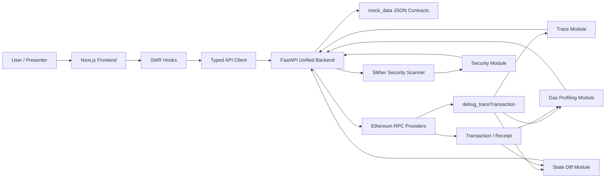

<div align="center">

# EVM Transaction Debugger & Analyzer

**A lightweight, mock-first toolkit for inspecting Ethereum transactions end-to-end** —
internal call trees, gas hotspots, state diffs, and Solidity vulnerabilities, all from a single tx hash.

[](LICENSE)
[](https://www.python.org/)
[](https://nodejs.org/)
[](https://fastapi.tiangolo.com/)
[](https://nextjs.org/)
[](https://github.com/crytic/slither)
[](#course-context)

</div>

---

## Table of Contents

- [Overview](#overview)
- [Features](#features)
- [Architecture](#architecture)
- [Project Structure](#project-structure)
- [Quick Start](#quick-start)
- [Configuration](#configuration)
- [API Reference](#api-reference)
- [Running Individual Modules](#running-individual-modules)
- [Testing](#testing)
- [Team Conventions](#team-conventions)
- [Documentation](#documentation)
- [Course Context](#course-context)
- [License](#license)

---

## Overview

The **EVM Transaction Debugger & Analyzer** turns a single Ethereum transaction hash into four orthogonal views — *what happened*, *what it cost*, *what changed on-chain*, and *what could go wrong* — and ships with a polished Next.js frontend on top.

It is built **mock-first**: every feature renders end-to-end from local JSON fixtures, so the full UI is demonstrable without an RPC key, a Slither binary, or network access. Flip a single environment switch and the same endpoints stream data from live RPC and a real Slither scan.

> [!TIP]
> Looking for a 2-minute sanity check? Run the [Quick Start](#quick-start) — the default `USE_MOCK=true` mode boots both servers with zero secrets.

---

## Features

| | Capability | What it does |
| --- | --- | --- |
| 🌳 | **Transaction Trace** | Renders the full call tree from `debug_traceTransaction`, decoded into `CALL` / `DELEGATECALL` / `STATICCALL` / `CREATE` nodes with selector-resolved function names. |
| ⛽ | **Gas Profiling** | Aggregates total gas, per-function breakdown with percentages, and opcode-level optimization hints. |
| 🔁 | **State Diff** | Surfaces ETH balance deltas and ERC-20 / 721 / 1155 transfers; storage slot diffs are extracted internally and ready for future UI exposure. |
| 🛡️ | **Vulnerability Scan** | Drives Slither against project fixtures, maps detectors to project categories (Reentrancy, Unchecked Call, Access Control, …), and emits a stable `ERR-NNN` schema. |
| 🧪 | **Mock-First** | A `mock_data/*.json` contract layer guarantees the frontend and backend stay schema-locked regardless of network state. |
| 🧰 | **Compatibility Endpoints** | Legacy POST routes are preserved alongside the new GET API so older notebooks and demos keep working. |

---

## Architecture



| Layer | Where | Responsibility |
| --- | --- | --- |
| **Presentation** | `frontend/src/app`, `frontend/src/components` | Input form, three analysis tabs, charts and tables. |
| **Frontend data** | `frontend/src/lib/api.ts`, `frontend/src/hooks` | SWR-cached, environment-switched client. |
| **Backend API** | `backend/app/main.py` | Single FastAPI entry point; mock loader + RPC adapter. |
| **Analysis services** | `backend/src/*`, `backend/security_scan.py` | Trace conversion, gas accounting, state diffs, Slither normalization. |
| **Data contracts** | `mock_data/*.json`, `frontend/src/types/*.ts` | Single source of truth for response schemas. |

Deeper design rationale lives in [`docs/architecture.md`](docs/architecture.md). API contracts and module ownership are in [`docs/technical-documentation.md`](docs/technical-documentation.md).

---

## Project Structure

```text
.
├── backend/                    # FastAPI service & Python analysis modules
│   ├── app/main.py             #   Unified entry point — routes, mock loader, RPC adapter
│   ├── src/
│   │   ├── api/                #   RPC clients: tx, receipt, debug_traceTransaction
│   │   ├── gas/                #   Gas profiling (analyzer + parser)
│   │   └── state/              #   State diff, balance, token-transfer extraction
│   ├── security_scan.py        #   Slither driver + report normalizer (CLI-capable)
│   └── tests/                  #   pytest contract tests
├── frontend/                   # Next.js 14 + TypeScript + Tailwind + SWR + Recharts
│   ├── src/app/                #   App-router pages
│   ├── src/components/         #   UI: TraceTab, GasStateTab, SecurityTab, charts
│   ├── src/hooks/              #   useTrace, useGasState, useSecurity (SWR)
│   ├── src/lib/api.ts          #   Mock/real backend switch
│   ├── src/types/              #   TypeScript mirrors of mock_data schemas
│   └── src/mocks/              #   Browser-side mock JSON
├── mock_data/                  # Authoritative response schemas (shared contracts)
│   ├── trace_response.json
│   ├── gas_state_response.json
│   └── security_response.json
├── test_contracts/             # Solidity fixtures for the security scanner
│   ├── AccessControlBug.sol
│   ├── OverflowToken.sol
│   ├── UncheckedCall.sol
│   └── VulnerableVault.sol
├── docs/                       # Architecture, technical docs, security analysis
│   ├── architecture.md
│   ├── technical-documentation.md
│   ├── security-analysis.md
│   ├── gas-optimization.md
│   └── proj.md
├── scripts/                    # Helper scripts
├── pyproject.toml              # uv-managed Python project
└── README.md
```

---

## Quick Start

### Prerequisites

| Tool | Version | Notes |
| --- | --- | --- |
| Python | ≥ 3.10 | required by the backend |
| [`uv`](https://docs.astral.sh/uv/) | latest | Python dependency manager |
| Node.js | ≥ 20 | required by the frontend |
| npm | latest | bundled with Node |
| `solc-select` *(optional)* | latest | only needed when running real Slither scans against the fixtures |

### 1. Install dependencies

```bash
# From repo root
uv sync

# Frontend
cd frontend && npm install && cd ..
```

`uv sync` materializes the `pyproject.toml` dependency set into `.venv/` and installs both runtime and dev (pytest, httpx) groups.

### 2. Boot the full stack (mock mode, no secrets required)

Two terminals:

```bash
# Terminal 1 — Backend (FastAPI, mock-first)
uv run uvicorn backend.app.main:app --host 127.0.0.1 --port 8000 --reload
```

```bash
# Terminal 2 — Frontend (Next.js dev server)
cd frontend && npm run dev
```

| Service | URL |
| --- | --- |
| Frontend | <http://127.0.0.1:3000> |
| Backend Swagger UI | <http://127.0.0.1:8000/docs> |
| Backend ReDoc | <http://127.0.0.1:8000/redoc> |

> [!TIP]
> If you change a frontend client component and the page doesn't update, clear `frontend/.next/` and restart `npm run dev` — Turbopack will occasionally cache stale chunks and cause hydration errors.

### 3. Flip to real on-chain mode (optional)

Create `frontend/.env.local`:

```env
NEXT_PUBLIC_USE_MOCKS=false
NEXT_PUBLIC_API_BASE_URL=http://127.0.0.1:8000
```

Create `.env` at the repository root (or under `backend/`):

```env
USE_MOCK=false
ALCHEMY_RPC_URL=https://eth-mainnet.g.alchemy.com/v2/...
QUICKNODE_RPC_URL=https://...quicknode.../        # must support the `debug` namespace
```

> [!IMPORTANT]
> `debug_traceTransaction` requires a node with the `debug` namespace enabled. Public RPCs and most free Alchemy tiers will reject it — use QuickNode, an archive node, or a similar provider.

---

## Configuration

### Backend

| Variable | Default | Purpose |
| --- | --- | --- |
| `USE_MOCK` | `true` | When `true`, the backend reads from `mock_data/*.json` and never touches the network. |
| `ALCHEMY_RPC_URL` | — | Used by `backend/src/api/tx.py` for `eth_getTransactionByHash` and receipt lookups. |
| `QUICKNODE_RPC_URL` | — | Used by `backend/src/api/trace.py` for `debug_traceTransaction`. |

### Frontend

| Variable | Default | Purpose |
| --- | --- | --- |
| `NEXT_PUBLIC_USE_MOCKS` | *enabled* | Set to `"false"` to fetch from the FastAPI backend instead of local JSON. |
| `NEXT_PUBLIC_API_BASE_URL` | `""` | Backend base URL, e.g. `http://127.0.0.1:8000`. |

---

## API Reference

The unified backend exposes three primary `GET` endpoints. Each one mirrors a JSON schema under `mock_data/`.

| Method | Path | Input | Schema | Source of truth |
| --- | --- | --- | --- | --- |
| `GET` | `/api/trace/{tx_hash}` | Transaction hash | `TraceResponse` | [`mock_data/trace_response.json`](mock_data/trace_response.json) |
| `GET` | `/api/gas-state/{tx_hash}` | Transaction hash | `GasStateResponse` | [`mock_data/gas_state_response.json`](mock_data/gas_state_response.json) |
| `GET` | `/api/security/{address}` | Contract address | `SecurityResponse` | [`mock_data/security_response.json`](mock_data/security_response.json) |

Three compatibility `POST` routes are kept for older clients:

| Method | Path | Body |
| --- | --- | --- |
| `POST` | `/api/trace` | `{ "txHash": "0x..." }` |
| `POST` | `/api/tx_gas` | `{ "txHash": "0x..." }` |
| `POST` | `/api/stat_diff` | `{ "txHash": "0x..." }` |

> [!NOTE]
> Schema evolution rule of thumb: **update `mock_data/` first**, then the frontend type in `frontend/src/types/`, then the backend response builder in `backend/app/main.py`.

---

## Running Individual Modules

### Security Scan

Module deep-dive: [`docs/security-analysis.md`](docs/security-analysis.md).

```bash
# First-time setup — install the Solidity versions used by the fixtures
uv run solc-select install 0.8.20
uv run solc-select install 0.7.6
```

The scanner reads each contract's `pragma solidity` and auto-switches via `solc-select`; manual `solc-select use` is not required.

```bash
# Single file
uv run python backend/security_scan.py test_contracts/VulnerableVault.sol --pretty

# With an output file
uv run python backend/security_scan.py test_contracts/VulnerableVault.sol --pretty \
  --output out/security.json

# Force a specific compiler version
uv run python backend/security_scan.py test_contracts/UncheckedCall.sol --pretty \
  --solc-version 0.8.20

# Scan every fixture
for f in test_contracts/*.sol; do
  echo "=== $f ==="
  uv run python backend/security_scan.py "$f" --pretty
done
```

Exit codes:

| Code | Meaning |
| --- | --- |
| `0` | Scan succeeded (including `CompletedWithNoFindings`). |
| `1` | Scan failed; the JSON payload includes an `error` field. |
| `2` | CLI misuse. |

### Trace API (standalone)

A legacy single-module entry point is preserved for unit-testing the trace pipeline in isolation:

```bash
uv run uvicorn backend.trace_api:app --host 127.0.0.1 --port 8000 --reload
```

Route: `POST /api/trace`, body `{ "txHash": "0x..." }`. Honors `USE_MOCK`.

### Gas Profiling / State Diff

Both are part of the unified backend — see the [Quick Start](#quick-start). To poke the analyzer directly:

```bash
uv run python -c "from backend.src.gas.analyzer import gas_profiling; print(gas_profiling.__doc__)"
```

Fixture data: [`mock_data/gas_state_response.json`](mock_data/gas_state_response.json).

### Frontend

```bash
cd frontend
npm run dev      # Dev server on http://127.0.0.1:3000
npm run build    # Production build
npm run start    # Serve the production build
npm run lint     # ESLint
```

Set `NEXT_PUBLIC_USE_MOCKS=true` in `frontend/.env.local` to render the full UI without a backend, using `frontend/src/mocks/*.json`.

---

## Testing

```bash
uv run pytest
```

Tests live in `backend/tests/` and currently cover:

- Trace endpoint returns `200` in mock mode.
- Tx-hash leading/trailing whitespace is trimmed.
- Invalid routes return `404`.
- Security-scan schema and scan logic invariants.

> [!TIP]
> Before merging a feature branch, the recommended pre-flight is `uv run pytest` + `cd frontend && npm run lint && npm run build`.

---

## Team Conventions

This is a five-role NTU SC6107 group project. Folder ownership is strict to minimise merge conflicts:

| Role | Owner of | Branch convention |
| --- | --- | --- |
| **Role 1** | `backend/src/api/trace.py` — trace extraction | `feature/trace-api` |
| **Role 2** | `backend/src/gas/`, `backend/src/state/` — gas + state diff | `feature/gas-profile` |
| **Role 3** | `backend/security_scan.py`, `test_contracts/` — security | `feature/security-scan` |
| **Role 4** | `frontend/` — UI & visualisation | `feature/frontend-ui` |
| **Role 5** | `docs/`, system architecture, final delivery | `docs/architecture-ppt` |

Ground rules:

1. **Never push directly to `main`.** It is protected — every change ships through a Pull Request.
2. **Branch per task.** Use the conventions above; one logical change per branch.
3. **Atomic, semantic commits.** Prefer conventional-commit style: `feat:`, `fix:`, `docs:`, `chore:`, `refactor:`, `test:`.
4. **PR → review → merge.** Role 5 owns final review and integration into `main`.

---

## Documentation

| Doc | What's inside |
| --- | --- |
| [`docs/architecture.md`](docs/architecture.md) | System architecture, module boundaries, data flow, deployment view. |
| [`docs/technical-documentation.md`](docs/technical-documentation.md) | Runtime manual, API contracts, module maintenance, testing notes. |
| [`docs/security-analysis.md`](docs/security-analysis.md) | Security scanner internals and detector mapping. |
| [`docs/gas-optimization.md`](docs/gas-optimization.md) | Gas profiling heuristics and optimization suggestions. |
| [`docs/proj.md`](docs/proj.md) | Project planning notes. |

---

## Course Context

This project is the **Option 7** submission for **NTU SC6107 — Blockchain Security**. It is intentionally scoped for a course deliverable:

- The security endpoint maps fixed addresses to local Solidity fixtures rather than fetching verified source from Etherscan.
- CORS is wide open (`allow_origins=["*"]`) — fine for the classroom demo, not for production.
- Mock mode is the canonical demo path; real mode is included to show feasibility.

Roadmap candidates beyond the course scope live at the bottom of [`docs/architecture.md`](docs/architecture.md#9-current-limitations--future-extensions).

---

## License

Released under the [MIT License](LICENSE) — © 2026 caohansg2025-cloud.

---

> [!NOTE]
> **AI Assistance Disclosure** — Portions of this project (code, documentation, and debugging) were produced with the help of AI coding assistants (e.g. Claude, ChatGPT).
