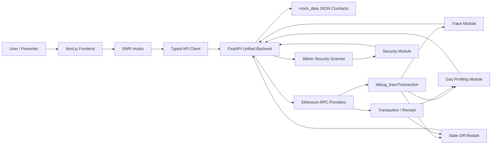
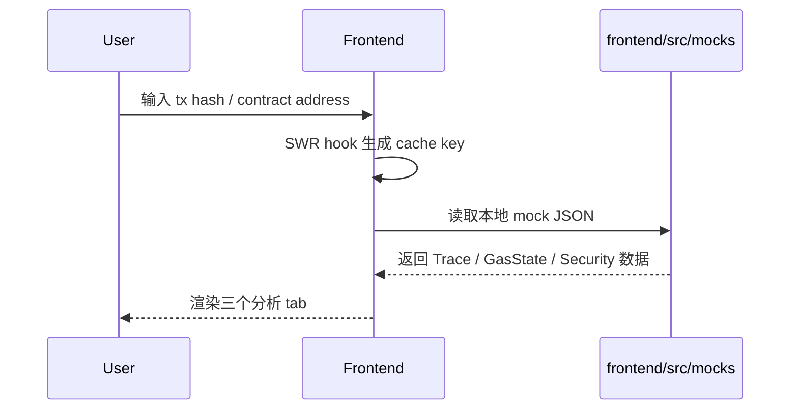
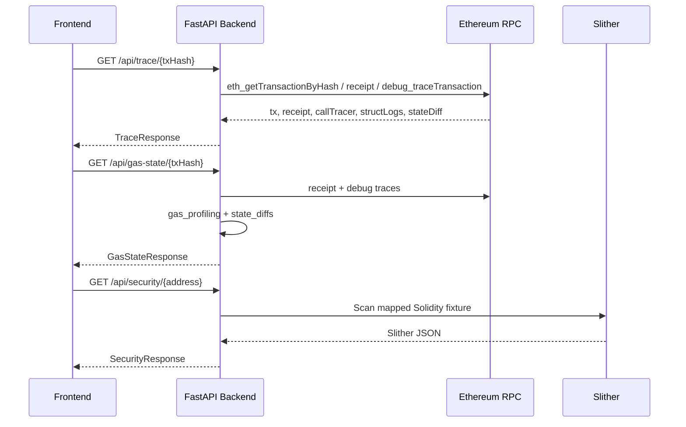
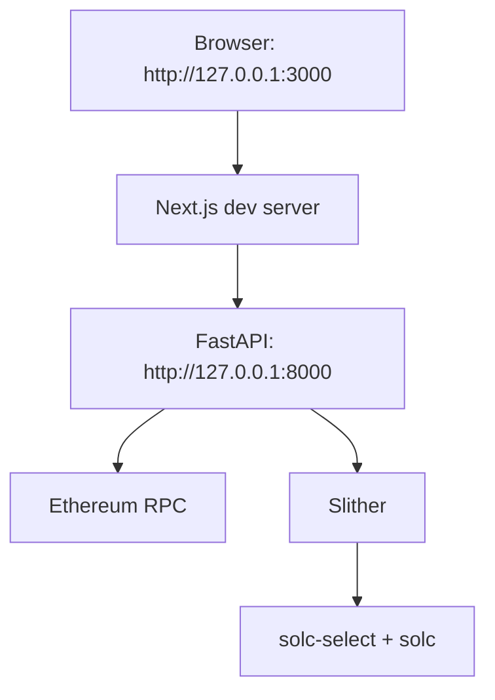

# EVM Transaction Debugger & Analyzer 系统架构设计说明

## 1. 文档目的

本文档面向 SC6107 项目交付、答辩和后续维护，说明 **EVM Transaction Debugger & Analyzer** 的系统目标、模块边界、核心数据流、接口契约和部署运行方式。当前项目采用前后端分离架构：前端负责交易调试与安全分析结果的交互展示，后端负责链上数据拉取、trace 解析、gas/state 分析和 Solidity 安全扫描。

## 2. 系统目标

项目目标是为以太坊交易提供一个轻量级调试与分析工具，帮助开发者从一笔交易中快速理解：

- 合约之间的内部调用关系。
- 每个函数或调用节点的 gas 消耗。
- 交易前后的 ETH/token 状态变化。
- 目标合约源代码中的常见安全风险。

当前实现支持 mock-first 开发模式。默认情况下，前端和后端可以直接使用 `mock_data/*.json` 完成演示；当关闭 mock 开关后，后端会尝试通过 RPC 与 Slither 生成真实分析结果。

## 3. 总体架构



架构分为五层：

| 层级 | 目录 / 文件 | 职责 |
| --- | --- | --- |
| 表现层 | `frontend/src/app`, `frontend/src/components` | 输入交易哈希或合约地址，展示 Trace、Gas & State、Security 三个分析视图。 |
| 前端数据层 | `frontend/src/lib/api.ts`, `frontend/src/hooks` | 通过环境变量切换 mock 数据或真实后端；使用 SWR 做请求缓存与加载状态管理。 |
| 后端 API 层 | `backend/app/main.py` | 统一 FastAPI 入口，暴露三个主要 GET 接口和若干兼容 POST 接口。 |
| 分析服务层 | `backend/src/*`, `backend/security_scan.py` | 执行 trace 转换、gas 统计、state diff 提取、Slither 扫描和输出标准化。 |
| 数据契约层 | `mock_data/*.json`, `frontend/src/types/*.ts` | 作为前后端共享 schema，约束字段名、层级和展示格式。 |

## 4. 模块划分

### 4.1 Frontend UI

前端基于 Next.js、React、TypeScript、Tailwind CSS 和 shadcn 风格组件构建。主页面位于 `frontend/src/app/page.tsx`，通过 Tabs 组织三个核心功能：

- `TraceTab`: 展示交易基础信息和递归调用树。
- `GasStateTab`: 展示总 gas、函数级 gas breakdown、优化建议、ETH 余额变化和 token transfer。
- `SecurityTab`: 展示 Slither 扫描摘要和漏洞卡片。

前端数据访问集中在 `frontend/src/lib/api.ts`。当 `NEXT_PUBLIC_USE_MOCKS` 不等于 `"false"` 时，前端直接读取 `frontend/src/mocks/*.json`；当设置为 `"false"` 时，前端请求 `NEXT_PUBLIC_API_BASE_URL` 指向的 FastAPI 服务。

### 4.2 Backend API Gateway

统一后端入口为 `backend/app/main.py`，主要职责包括：

- 读取 `.env` 配置并决定 `USE_MOCK` 模式。
- 加载 `mock_data/*.json`，保证演示环境稳定。
- 对外暴露 trace、gas-state、security 三类统一接口。
- 对真实 RPC 结果做字段转换，返回前端约定 schema。
- 使用简单 LRU cache 避免同一交易在一次服务生命周期内重复请求 trace。

主要接口如下：

| Method | Path | 输入 | 输出 |
| --- | --- | --- | --- |
| GET | `/api/trace/{tx_hash}` | 交易哈希 | `TraceResponse` |
| GET | `/api/gas-state/{tx_hash}` | 交易哈希 | `GasStateResponse` |
| GET | `/api/security/{address}` | 合约地址 | `SecurityResponse` |
| POST | `/api/trace` | `{ "txHash": "0x..." }` | 兼容旧版 trace 接口 |
| POST | `/api/tx_gas` | `{ "txHash": "0x..." }` | 兼容旧版 gas 接口 |
| POST | `/api/stat_diff` | `{ "txHash": "0x..." }` | 兼容旧版 state diff 接口 |

### 4.3 Transaction Trace Analysis

Trace 模块由 `backend/src/api/trace.py` 和 `backend/app/main.py::convert_call_tree_to_trace_tree()` 组成。

真实模式下，后端通过 `debug_traceTransaction` 请求三类 trace：

- 默认 struct logs: 用于 opcode gas 分析。
- `callTracer`: 用于构建合约调用树。
- `stateDiffTracer`: 用于提取 storage/balance state diff。

后端将 `callTracer` 结果转换为前端需要的递归 `traceTree`，并补齐：

- `type`: CALL / DELEGATECALL / STATICCALL / CREATE。
- `from`, `to`: 调用两端地址。
- `value`: 以 ETH 为单位的展示字符串。
- `gasUsed`: 十进制 gas 数值。
- `functionName`: 通过 selector 映射或 fallback 规则生成的函数名。
- `calls`: 子调用数组。

### 4.4 Gas Profiling

Gas 模块位于 `backend/src/gas`：

- `analyzer.py`: 对外提供 `gas_profiling()`，聚合总 gas、函数 gas、调用树 gas 和 opcode gas。
- `parser.py`: 递归遍历 call tree，生成函数级 gas 统计和 gas tree。

真实模式下，`/api/gas-state/{tx_hash}` 会把 gas 模块的内部结构转换为前端展示结构：

- `totalGasUsed`: receipt 中的总 gas。
- `breakdown[]`: 函数或合约调用维度的 gas 消耗与占比。
- `optimizationSuggestions`: 根据高消耗 opcode 给出简要优化建议。

### 4.5 State Diff Visualization

State 模块位于 `backend/src/state/analyzer.py`，负责从 trace 和 receipt 中提取：

- storage slot 变化。
- ETH balance 变化。
- ERC-20 / ERC-721 / ERC-1155 Transfer 事件。

当前前端契约主要展示 `balanceChanges` 与 `tokenTransfers`。`storageChanges` 已在后端内部返回，但尚未暴露到当前前端展示 schema 中，可作为后续增强点。

### 4.6 Vulnerability Detection

安全扫描模块位于 `backend/security_scan.py`，通过 Slither 扫描本地 Solidity 源文件，并把 Slither detector 输出标准化为 `mock_data/security_response.json` 对应 schema。

关键设计：

- 自动解析 `pragma solidity`，尝试通过 `solc-select` 切换匹配版本。
- 将 Slither detector 映射到项目类别，如 Reentrancy、Unchecked External Call、Access Control Issue。
- 按 severity 和 line 稳定排序，并生成 `ERR-001` 风格的 deterministic ID。
- 扫描失败也返回结构化 JSON，而不是让前端收到不可解析错误。

当前 `/api/security/{address}` 使用地址到本地 fixture 的映射表，例如：

| Address | Solidity fixture |
| --- | --- |
| `0x7a250d5630b4cf539739df2c5dacb4c659f2488d` | `test_contracts/VulnerableVault.sol` |
| `0x1111111111111111111111111111111111111111` | `test_contracts/AccessControlBug.sol` |
| `0x2222222222222222222222222222222222222222` | `test_contracts/UncheckedCall.sol` |
| `0x3333333333333333333333333333333333333333` | `test_contracts/OverflowToken.sol` |

## 5. 核心数据流

### 5.1 Mock 演示数据流



此模式适合课堂展示、前端开发和无 RPC key 的本地运行。

### 5.2 真实后端数据流



## 6. API 数据契约

`mock_data/` 是项目内最重要的数据契约来源，前端类型定义应与其保持一致。

| Contract | Source | Frontend type | Backend endpoint |
| --- | --- | --- | --- |
| Trace | `mock_data/trace_response.json` | `frontend/src/types/trace.ts` | `/api/trace/{tx_hash}` |
| Gas + State | `mock_data/gas_state_response.json` | `frontend/src/types/gasState.ts` | `/api/gas-state/{tx_hash}` |
| Security | `mock_data/security_response.json` | `frontend/src/types/security.ts` | `/api/security/{address}` |

接口演进原则：

1. 字段改名或层级调整必须先更新 `mock_data`，再同步后端输出和前端类型。
2. 对展示层无用但后续可能使用的字段应优先保持向后兼容。
3. 前端不直接消费 RPC 原始结构，所有链上数据必须由后端归一化。

## 7. 配置与部署视图

### 7.1 本地开发配置

后端配置：

| Variable | 默认值 | 说明 |
| --- | --- | --- |
| `USE_MOCK` | `true` | `true` 时直接读取 `mock_data`; `false` 时尝试真实 RPC 和 Slither。 |
| `ALCHEMY_RPC_URL` | 无 | `backend/src/api/tx.py` 使用，用于交易和 receipt 查询。 |
| `QUICKNODE_RPC_URL` | 无 | `backend/src/api/trace.py` 使用，用于 `debug_traceTransaction`。 |

前端配置：

| Variable | 默认值 | 说明 |
| --- | --- | --- |
| `NEXT_PUBLIC_USE_MOCKS` | mock enabled | 值为 `"false"` 时请求真实后端。 |
| `NEXT_PUBLIC_API_BASE_URL` | `""` | 真实后端地址，常用 `http://127.0.0.1:8000`。 |

### 7.2 运行拓扑



本地启动建议：

```bash
uv sync
uv run uvicorn backend.app.main:app --host 127.0.0.1 --port 8000 --reload

cd frontend
npm install
npm run dev
```

## 8. 非功能性设计

| 维度 | 当前设计 |
| --- | --- |
| 可演示性 | mock-first，缺少 RPC key 或 Slither 环境时仍可展示完整 UI。 |
| 可维护性 | 前后端通过 `mock_data` 和 TypeScript 类型约束数据契约。 |
| 性能 | 后端 LRU cache 缓存近期 trace，前端 SWR 缓存 tab 切换结果。 |
| 可观测性 | 后端使用标准 logging 记录配置、请求和异常。 |
| 容错 | mock 文件缺失、RPC 失败、Slither 失败均通过 HTTPException 或结构化 error 暴露。 |
| 安全性 | 当前 CORS 为 `allow_origins=["*"]`，适合本地演示；生产环境应收敛来源。 |

## 9. 当前限制与后续扩展

当前限制：

- 真实链上模式依赖 RPC provider 支持 `debug_traceTransaction`。
- Security endpoint 当前通过固定地址映射到本地 Solidity fixture，不会自动从 Etherscan 拉取 verified source。
- Storage diff 已在后端提取，但前端当前主要展示 balance 与 token transfer。
- CORS、RPC key 管理和错误分级仍以课程项目本地演示为主要场景。

后续扩展建议：

- 增加 Etherscan source fetch，将真实合约地址自动映射到源码扫描。
- 将 storage diff 纳入前端展示，并支持 slot 解码。
- 为 trace/gas/state 建立统一 Pydantic response model。
- 增加 Redis 或文件级缓存，避免重复 RPC trace。
- 增加 PR 合并前 CI：`uv run pytest`、`npm run lint`、`npm run build`。

## 10. 五号位交付边界

五号位负责系统级交付材料，建议维护以下内容：

- `docs/architecture.md`: 系统架构、模块边界、数据流与部署视图。
- `docs/technical-documentation.md`: 运行手册、API 契约、模块维护和测试说明。
- 最终答辩 PPT / Demo script: 从 mock 模式稳定演示，再说明真实模式的 RPC/Slither 依赖。

该分工可以降低开发同学之间的合并冲突，也能确保最终汇报材料与实际代码保持一致。
