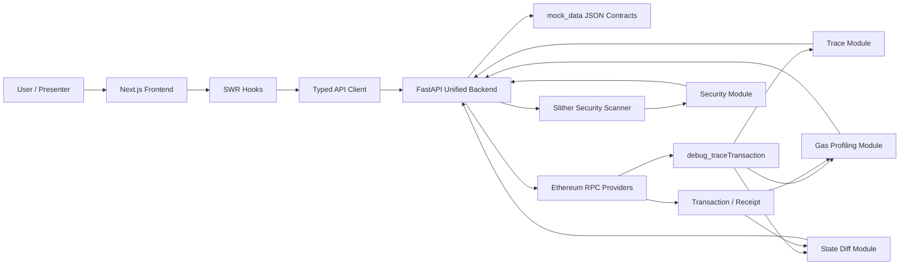
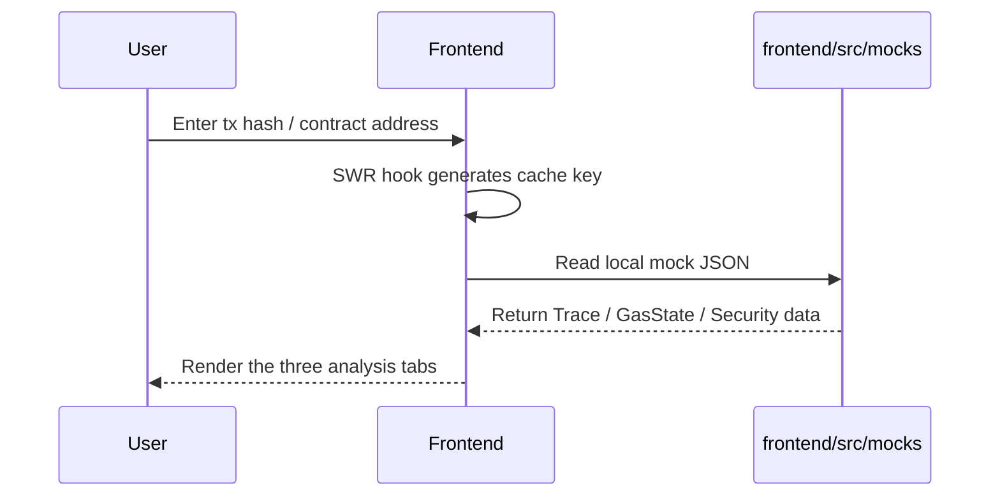
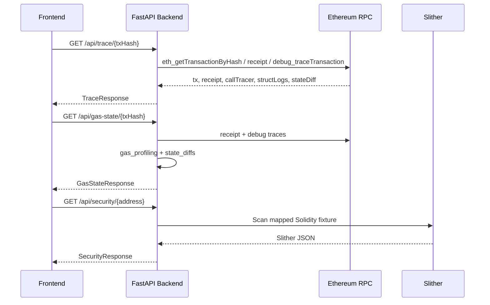
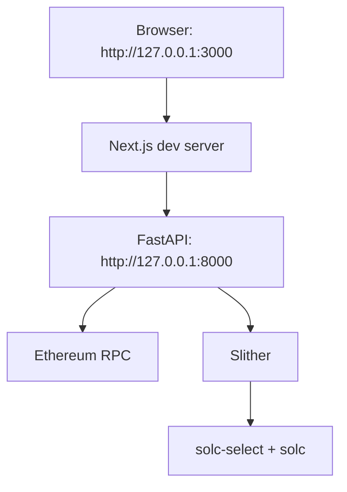

# EVM Transaction Debugger & Analyzer — System Architecture

## 1. Document Purpose

This document is written for SC6107 project delivery, the defense presentation, and subsequent maintenance. It describes the **EVM Transaction Debugger & Analyzer**'s system goals, module boundaries, core data flows, interface contracts, and deployment / runtime model. The project follows a decoupled frontend/backend architecture: the frontend handles interactive presentation of transaction debugging and security analysis results, while the backend handles on-chain data retrieval, trace parsing, gas/state analysis, and Solidity security scanning.

## 2. System Goals

The project provides a lightweight debugger and analyzer for Ethereum transactions. It helps developers quickly understand, from a single transaction:

- Internal call relationships between contracts.
- Gas consumption of each function or call node.
- ETH / token state changes before and after the transaction.
- Common security risks in the target contract's source code.

The current implementation supports a mock-first development mode. By default, the frontend and backend can run a full demo directly from `mock_data/*.json`. When the mock switch is turned off, the backend attempts to produce real analysis results via RPC and Slither.

## 3. Overall Architecture



The architecture has five layers:

| Layer | Directory / Files | Responsibility |
| --- | --- | --- |
| Presentation | `frontend/src/app`, `frontend/src/components` | Accepts a transaction hash or contract address and renders the Trace, Gas & State, and Security analysis views. |
| Frontend data | `frontend/src/lib/api.ts`, `frontend/src/hooks` | Switches between mock data and the real backend via environment variables; uses SWR for request caching and loading-state management. |
| Backend API | `backend/app/main.py` | The unified FastAPI entry point — exposes the three primary GET endpoints and several compatibility POST endpoints. |
| Analysis services | `backend/src/*`, `backend/security_scan.py` | Performs trace conversion, gas accounting, state-diff extraction, Slither scanning, and output normalization. |
| Data contracts | `mock_data/*.json`, `frontend/src/types/*.ts` | Acts as the shared schema between frontend and backend, constraining field names, structure, and presentation format. |

## 4. Module Breakdown

### 4.1 Frontend UI

The frontend is built on Next.js, React, TypeScript, Tailwind CSS, and shadcn-style components. The main page lives at `frontend/src/app/page.tsx`, and tabs organize three core capabilities:

- `TraceTab`: shows basic transaction info and a recursive call tree.
- `GasStateTab`: shows total gas, per-function gas breakdown, optimization suggestions, ETH balance changes, and token transfers.
- `SecurityTab`: shows the Slither scan summary and vulnerability cards.

Frontend data access is centralized in `frontend/src/lib/api.ts`. When `NEXT_PUBLIC_USE_MOCKS` is not equal to `"false"`, the frontend reads directly from `frontend/src/mocks/*.json`; when set to `"false"`, the frontend talks to the FastAPI service pointed to by `NEXT_PUBLIC_API_BASE_URL`.

### 4.2 Backend API Gateway

The unified backend entry point is `backend/app/main.py`. Its main responsibilities are:

- Read `.env` configuration and decide the `USE_MOCK` mode.
- Load `mock_data/*.json` to keep the demo environment stable.
- Expose unified trace, gas-state, and security endpoints externally.
- Convert real RPC results into the schema agreed with the frontend.
- Use a simple LRU cache to avoid repeated trace requests for the same transaction during a single service lifetime.

The primary endpoints are:

| Method | Path | Input | Output |
| --- | --- | --- | --- |
| GET | `/api/trace/{tx_hash}` | Transaction hash | `TraceResponse` |
| GET | `/api/gas-state/{tx_hash}` | Transaction hash | `GasStateResponse` |
| GET | `/api/security/{address}` | Contract address | `SecurityResponse` |
| POST | `/api/trace` | `{ "txHash": "0x..." }` | Compatibility wrapper for the legacy trace endpoint |
| POST | `/api/tx_gas` | `{ "txHash": "0x..." }` | Compatibility wrapper for the legacy gas endpoint |
| POST | `/api/stat_diff` | `{ "txHash": "0x..." }` | Compatibility wrapper for the legacy state-diff endpoint |

### 4.3 Transaction Trace Analysis

The trace module is composed of `backend/src/api/trace.py` and `backend/app/main.py::convert_call_tree_to_trace_tree()`.

In real mode, the backend requests three kinds of trace via `debug_traceTransaction`:

- Default struct logs: used for opcode-level gas analysis.
- `callTracer`: used to build the contract call tree.
- `stateDiffTracer`: used to extract storage / balance state diffs.

The backend converts the `callTracer` output into the recursive `traceTree` the frontend expects, filling in:

- `type`: CALL / DELEGATECALL / STATICCALL / CREATE.
- `from`, `to`: the call's caller and callee addresses.
- `value`: a display string denominated in ETH.
- `gasUsed`: decimal gas amount.
- `functionName`: function name produced by selector lookup or a fallback rule.
- `calls`: array of sub-calls.

### 4.4 Gas Profiling

The gas module lives in `backend/src/gas`:

- `analyzer.py`: exposes `gas_profiling()`, which aggregates total gas, function gas, call-tree gas, and opcode gas.
- `parser.py`: recursively walks the call tree to produce per-function gas statistics and the gas tree.

In real mode, `/api/gas-state/{tx_hash}` converts the gas module's internal structure into the structure the frontend expects:

- `totalGasUsed`: total gas from the receipt.
- `breakdown[]`: gas usage and percentage, broken down by function or contract call.
- `optimizationSuggestions`: brief optimization suggestions based on high-cost opcodes.

### 4.5 State Diff Visualization

The state module lives at `backend/src/state/analyzer.py` and extracts the following from trace and receipt:

- Storage slot changes.
- ETH balance changes.
- ERC-20 / ERC-721 / ERC-1155 Transfer events.

The current frontend contract mainly surfaces `balanceChanges` and `tokenTransfers`. `storageChanges` is already returned internally by the backend but is not yet exposed in the frontend display schema; it is a candidate for future enhancement.

### 4.6 Vulnerability Detection

The security scanner lives at `backend/security_scan.py`. It scans local Solidity source files via Slither and normalizes the Slither detector output into the schema defined by `mock_data/security_response.json`.

Key design points:

- Automatically parses `pragma solidity` and attempts to switch to a matching compiler version via `solc-select`.
- Maps Slither detectors to project categories such as Reentrancy, Unchecked External Call, and Access Control Issue.
- Stable-sorts findings by severity and line, and generates deterministic IDs in the `ERR-001` style.
- Returns structured JSON even on scan failure, so the frontend never has to handle an unparsable error.

The current `/api/security/{address}` uses an address-to-local-fixture mapping table, e.g.:

| Address | Solidity fixture |
| --- | --- |
| `0x7a250d5630b4cf539739df2c5dacb4c659f2488d` | `test_contracts/VulnerableVault.sol` |
| `0x1111111111111111111111111111111111111111` | `test_contracts/AccessControlBug.sol` |
| `0x2222222222222222222222222222222222222222` | `test_contracts/UncheckedCall.sol` |
| `0x3333333333333333333333333333333333333333` | `test_contracts/OverflowToken.sol` |

## 5. Core Data Flows

### 5.1 Mock Demo Data Flow



This mode is suited to classroom demos, frontend development, and local runs without an RPC key.

### 5.2 Real Backend Data Flow



## 6. API Data Contracts

`mock_data/` is the most important source of data contracts in the project; frontend type definitions must stay aligned with it.

| Contract | Source | Frontend type | Backend endpoint |
| --- | --- | --- | --- |
| Trace | `mock_data/trace_response.json` | `frontend/src/types/trace.ts` | `/api/trace/{tx_hash}` |
| Gas + State | `mock_data/gas_state_response.json` | `frontend/src/types/gasState.ts` | `/api/gas-state/{tx_hash}` |
| Security | `mock_data/security_response.json` | `frontend/src/types/security.ts` | `/api/security/{address}` |

API evolution principles:

1. Field renames or structural changes must first update `mock_data`, then sync the backend output and the frontend types.
2. Fields not currently used by the display layer but potentially useful in the future should remain backward-compatible whenever possible.
3. The frontend never consumes raw RPC structures directly; all on-chain data must be normalized by the backend.

## 7. Configuration & Deployment View

### 7.1 Local Development Configuration

Backend configuration:

| Variable | Default | Description |
| --- | --- | --- |
| `USE_MOCK` | `true` | When `true`, reads directly from `mock_data`; when `false`, attempts real RPC and Slither. |
| `ALCHEMY_RPC_URL` | none | Used by `backend/src/api/tx.py` for transaction and receipt lookups. |
| `QUICKNODE_RPC_URL` | none | Used by `backend/src/api/trace.py` for `debug_traceTransaction`. |

Frontend configuration:

| Variable | Default | Description |
| --- | --- | --- |
| `NEXT_PUBLIC_USE_MOCKS` | mock enabled | When set to `"false"`, requests go to the real backend. |
| `NEXT_PUBLIC_API_BASE_URL` | `""` | Real backend address — typically `http://127.0.0.1:8000`. |

### 7.2 Runtime Topology



Recommended local startup:

```bash
uv sync
uv run uvicorn backend.app.main:app --host 127.0.0.1 --port 8000 --reload

cd frontend
npm install
npm run dev
```

## 8. Non-Functional Design

| Dimension | Current design |
| --- | --- |
| Demoability | Mock-first; the full UI is still demonstrable when an RPC key or Slither environment is unavailable. |
| Maintainability | Frontend and backend share data contracts through `mock_data` and TypeScript types. |
| Performance | The backend uses an LRU cache for recent traces; the frontend uses SWR to cache tab-switch results. |
| Observability | The backend uses standard logging for configuration, requests, and exceptions. |
| Fault tolerance | Missing mock files, RPC failures, and Slither failures all surface via HTTPException or structured error responses. |
| Security | CORS is currently `allow_origins=["*"]`, which is fine for local demos; production deployments should restrict origins. |

## 9. Current Limitations & Future Extensions

Current limitations:

- Real on-chain mode depends on an RPC provider that supports `debug_traceTransaction`.
- The security endpoint currently maps fixed addresses to local Solidity fixtures and does not automatically fetch verified source from Etherscan.
- Storage diff is already extracted by the backend, but the frontend currently surfaces mainly balance and token-transfer changes.
- CORS, RPC-key management, and error tiering are still oriented toward the course project's local demo scenario.

Suggested future extensions:

- Add Etherscan source fetching so real contract addresses can be automatically mapped to scanned source code.
- Surface storage diff in the frontend and support slot decoding.
- Introduce a unified Pydantic response model for trace / gas / state.
- Add Redis or file-level caching to avoid redundant RPC traces.
- Add pre-merge CI: `uv run pytest`, `npm run lint`, `npm run build`.

## 10. Role-5 Delivery Boundary

Role 5 is responsible for system-level deliverables and is expected to maintain:

- `docs/architecture.md`: system architecture, module boundaries, data flows, and deployment view.
- `docs/technical-documentation.md`: operations manual, API contracts, module maintenance, and testing notes.
- The final defense slide deck and demo script: deliver a stable demo from mock mode first, then explain the RPC / Slither dependencies of real mode.

This division of work reduces merge conflicts among the development members and keeps the final presentation materials aligned with the actual code.
